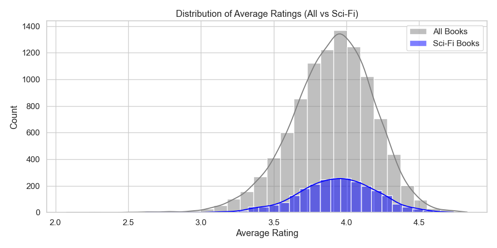
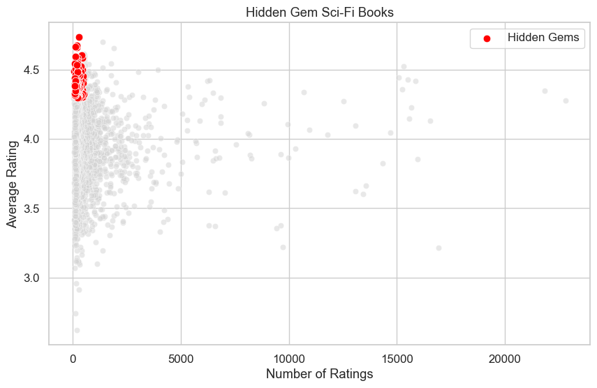
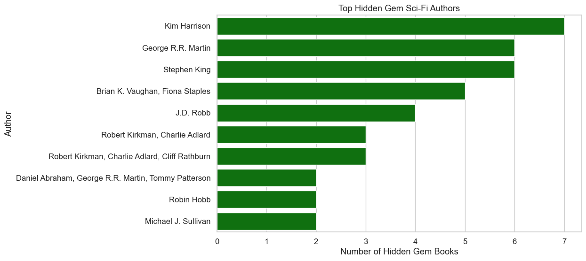

# Sci-Fi Hidden Gems Analysis

## Executive Summary
This project explores the Goodbooks-10k dataset to uncover “hidden gems” in science fiction—books and authors that are highly rated but haven’t received much attention. The goal is to identify under-the-radar titles that could be promoted or recommended to readers, helping publishers, platforms, and book enthusiasts discover quality content that might otherwise be overlooked.

## Business Problem
Platforms and publishers often focus on the most popular books, which can leave high-quality but lesser-known titles unnoticed. The central question this project addresses is:

**Which sci-fi books and authors are hidden gems—highly rated, but under-the-radar?**

## Methodology
### Data Loading & Cleaning
- Loaded `books.csv`, `ratings.csv`, `book_tags.csv`, and `tags.csv`.  
- Removed duplicates, standardized column names, and handled missing publication years.  

### Filter Sci-Fi Books
- Used tag data to filter only books labeled as *science-fiction*.  

### Hidden Gems Analysis
- **Books:** Flagged books with high average ratings but relatively few total ratings.  
- **Authors:** Identified authors who consistently write strong books but haven’t reached a wide audience.  

### Visualization
- Ratings distribution: All books vs. sci-fi books.  
- Scatterplot: Sci-fi books mapped by number of ratings vs. average rating, highlighting hidden gems.  
- Bar chart: Top hidden gem authors with underrated works.  

## Key Findings
- Hidden gems exist across the dataset: high-quality books that aren’t widely read.  
- Example cutoff: books with an average rating > **4.3** but fewer than **500 ratings**.  
- Several authors show consistent quality but remain under the radar—opportunities for promotion and discovery.  

## Business Recommendations
- **Promote Hidden Gems:** Include these books in curated lists, newsletters, or recommendation engines.  
- **Spotlight Underrated Authors:** Feature authors with strong but under-read works.  
- **Marketing Opportunities:** Reissue older gems or create collections (e.g., “Forgotten Sci-Fi Classics”).  

## Next Steps
- Explore sci-fi sub-genres (cyberpunk, dystopian, space opera) to find niche hidden gems.  
- Save results as CSVs or build an interactive dashboard for easier discovery.  
- Refine author-level metrics to handle multi-author books individually.  
- Extend analysis to include reviews or descriptions for deeper insights.  

## Dataset
- **Source:** [Goodbooks-10k Dataset](https://github.com/zygmuntz/goodbooks-10k)  
- **Files used:** `books.csv`, `ratings.csv`, `book_tags.csv`, `tags.csv`  

## Tech Stack
- **Python** – Data analysis and visualization  
- **Pandas** – Data cleaning and manipulation  
- **Matplotlib / Seaborn** – Data visualization  
- **Logging** – Status and progress reporting  

## Screenshots
**Ratings Distribution (All vs. Sci-Fi)**  


**Hidden Gem Sci-Fi Books (Scatterplot)**  


**Top Hidden Gem Authors (Bar Chart)**  


## How to Run
1. Clone the repository.  
2. Install dependencies:  
   ```bash
   pip install pandas matplotlib seaborn
Place the dataset CSVs in the same directory as the script.


